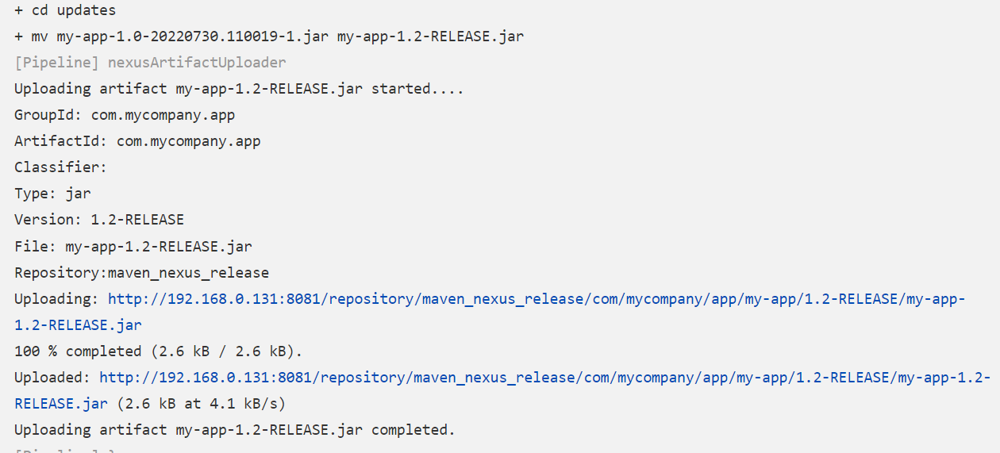

## Nexus制品上传


## Nexus 的作用

1. 私服仓库： 本地maven私服加快构建速度
2. 代理仓库： 将公网等第三方的库代理到本地

## nexus安装

1.  docker pull sonatype/nexus3 

2. mkdir -p /docker/nexus/

3. chmod 755 /docker/nexus/ 

4.  docker run -d --restart always --name nexus3 -p 8081:8081 -v /docker/nexus:/var/nexus-data sonatype/nexus3 

5.  docker exec -it 6eea6c9aacb2 /bin/bash 

6. cat  /nexus-data/admin.password  获取admin命令

7. 登录 nexus ip:8081 后修改管理员密码

   

## 组件

每一个包就是一个组件，nexus中的依赖包就是组件可以是jar包，可以是war包，可以是图片等等


## assets 资产


## maven下载机制


## 组件坐标

注意gav的定义


maven 存储库存储两种类型的组件，稳定版和快照，实际工作中不建议用快照

新建仓库，大多情况下有两种，一种是本地，一种是代理


## mvn deploy上传制品

1. 创建仓库maven-hosted

2. 配置maven-hosted 认证

3. 在maven的setting.xml添加私库信息

   ```
    <servers>
       <server>
         <id>maven-nexus-repo</id>
         <username>admin</username>
         <password>Nexus</password>
       </server>
   
     </servers>
   ```

   说明： id 为对应的nexus中仓库的id

4. 将mvn上传的方式集成到jenkin的共享库中

   ```
   //获取POM中的坐标
   def GetGav(){
      //上传制品
       def jarName = sh returnStdout: true, script: "cd target;ls *.jar"
       env.jarName = jarName - "\n"
       
       def pom = readMavenPom file: 'pom.xml'
       env.pomVersion = "${pom.version}"
       env.pomArtifact = "${pom.artifactId}"
       env.pomPackaging = "${pom.packaging}"
       env.pomGroupId = "${pom.groupId}"
       
       println("${pomGroupId}-${pomArtifact}-${pomVersion}-${pomPackaging}")
   
       return ["${pomGroupId}","${pomArtifact}","${pomVersion}","${pomPackaging}"]
   }
   
   
   //Nexus plugin deploy
   def NexusUpload(){
       //use nexus plugin
       nexusArtifactUploader artifacts: [[artifactId: "${pomArtifact}", 
                                           classifier: '', 
                                           file: "${filePath}", 
                                           type: "${pomPackaging}"]], 
                               credentialsId: '0c2b0fb5-3ef4-44fe-91d4-86906387a2c4', 
                               groupId: "${pomGroupId}", 
                               nexusUrl: '192.168.0.131:8081', 
                               nexusVersion: 'nexus3', 
                               protocol: 'http', 
                               repository: "${repoName}", 
                               version: "${pomVersion}"
   }
   
   //mvn deploy
   def MavenUpload(){          
       def mvnHome = tool "M2"
       sh  """ 
           cd target/
           ${mvnHome}/bin/mvn deploy:deploy-file -Dmaven.test.skip=true  \
                                   -Dfile=${jarName} -DgroupId=${pomGroupId} \
                                   -DartifactId=${pomArtifact} -Dversion=${pomVersion}  \
                                   -Dpackaging=${pomPackaging} -DrepositoryId=maven-nexus-repo \
                                   -Durl=http://192.168.0.131:8081/repository/maven-nexus-repo 
           """
   }
   
   //制品晋级
   def ArtifactUpdate(updateType,artifactUrl){
   
       //晋级策略
       if ("${updateType}" == "snapshot -> release"){
           println("snapshot -> release")
   
           //下载原始制品
           sh "  rm -fr updates && mkdir updates && cd updates && wget ${artifactUrl} && ls -l "
   
           //获取artifactID 
           
           artifactUrl = artifactUrl -  "http://192.168.1.200:30083/repository/maven-hostd/"
           artifactUrl = artifactUrl.split("/").toList()
           
           println(artifactUrl.size())
           env.jarName = artifactUrl[-1] 
           env.pomVersion = artifactUrl[-2].replace("SNAPSHOT","RELEASE")
           env.pomArtifact = artifactUrl[-3]
           pomPackaging = artifactUrl[-1]
           pomPackaging = pomPackaging.split("\\.").toList()[-1]
           env.pomPackaging = pomPackaging[-1]
           env.pomGroupId = artifactUrl[0..-4].join(".")
           println("${pomGroupId}##${pomArtifact}##${pomVersion}##${pomPackaging}")
           env.newJarName = "${pomArtifact}-${pomVersion}.${pomPackaging}"
           
           //更改名称
           sh " cd updates && mv ${jarName} ${newJarName} "
           
           //上传制品
           env.repoName = "maven-release"
           env.filePath = "updates/${newJarName}"
           NexusUpload()
       }
   }
   
   
   def main(uploadType){
       GetGav()
       if ("${uploadType}" == "maven"){
           MavenUpload()
       } else if ("${uploadType}" == "nexus") {
           env.repoName = "maven-nexus-repo"
           env.filePath = "target/${jarName}"
           NexusUpload()
       }
   }def MavenUpload(){          
       def mvnHome = tool "M2"
       sh  """ 
           cd target/
           ${mvnHome}/bin/mvn deploy:deploy-file -Dmaven.test.skip=true  \
                                   -Dfile=${jarName} -DgroupId=${pomGroupId} \
                                   -DartifactId=${pomArtifact} -Dversion=${pomVersion}  \
                                   -Dpackaging=${pomPackaging} -DrepositoryId=maven-nexus-repo \
                                   -Durl=http://192.168.0.131:8081/repository/maven-nexus-repo 
           """
   }
   ```

   5. 在pipeline打包完成后，调用函数，执行上传制品函数，参数选择maven

      

### nexus 插件上传制品

1.  系统设置--->插件管理--->可用插件 选择nexus-artifact-uploader插件安装

2.  我的视图--->对应项目---流水线语法--->片段生成器--->nexus对应的选项，输入相关信息注意： 片段生成器都是单引号，引入到pipeline中需要使用双号

   

3.  需要修改pom文件，注意不容version对应不同的仓库类型, 如果远程仓库时mix类型，则可以向其中传入发布版和快照， 如果为release ，则仅可以向远程仓库中传入发布版，如果为snapshot,则仅可以上传快照版，在pom文件中，版本必须大写如1.1-RELEASE 1.1-SNAPSHOT

   1.  发布版

   ```
   <modelVersion>4.0.0</modelVersion>
     <groupId>com.mycompany.app</groupId>
     <artifactId>my-app</artifactId>
     <packaging>jar</packaging>
     <version>1.1-RELEASE</version>
     <name>my-app</name>
   ```

   2. 快照版

   ```
    <groupId>com.mycompany.app</groupId>
     <artifactId>my-app</artifactId>
     <packaging>jar</packaging>
     <version>1.1-SNAPSHOT</version>
     <name>my-app</name>
   ```

4.  开始执行流水线

   1.  看到如下日志，则说明执行成功

      ```
      Type: jar
      Version: 1.1-RELEASE
      File: my-app-1.1-RELEASE.jar
      Repository:maven_nexus_release
      Uploading: http://192.168.0.131:8081/repository/maven_nexus_release/com/mycompany/app/my-app/1.1-RELEASE/my-app-1.1-RELEASE.jar
      100 % completed (2.6 kB / 2.6 kB).
      Uploaded: http://192.168.0.131:8081/repository/maven_nexus_release/com/mycompany/app/my-app/1.1-RELEASE/my-app-1.1-RELEASE.jar (2.6 kB at 6.0 kB/s)
      Uploading artifact my-app-1.1-RELEASE.jar completed.
      ```

      

   2. 看到如下日志，则说明版本和对应的仓库类型不一致， 示例是向发布版仓库上传快照打印的日志

      ```
      Version: 1.1-SNAPSHOT
      File: my-app-1.1-SNAPSHOT.jar
      Repository:maven_nexus_release
      Downloading: http://192.168.0.131:8081/repository/maven_nexus_release/com/mycompany/app/my-app/1.1-SNAPSHOT/maven-metadata.xml
      Uploading: http://192.168.0.131:8081/repository/maven_nexus_release/com/mycompany/app/my-app/1.1-SNAPSHOT/my-app-1.1-20220730.160033-1.jar
      100 % completed (2.6 kB / 2.6 kB).
      Failed to deploy artifacts: Could not transfer artifact com.mycompany.app:my-app:jar:1.1-20220730.160033-1 from/to maven_nexus_release (http://192.168.0.131:8081/repository/maven_nexus_release): Failed to transfer file: http://192.168.0.131:8081/repository/maven_nexus_release/com/mycompany/app/my-app/1.1-SNAPSHOT/my-app-1.1-20220730.160033-1.jar. Return code is: 400, ReasonPhrase:Repository version policy: RELEASE does not allow version: 1.1-20220730.160033-1.
      ```

   

### 问题记录

安装插件是一直是pending状态或者一直是等待状态，大概率是插件源不好导致，此时需要访问 http://ip/pluginManager/advanced， 找到升级站点，将url替换为清华站点https://mirrors.tuna.tsinghua.edu.cn/jenkins/updates/update-center.json

然后提交。 然后重启服务http://ip/restart


## 制品发布-选择制品


1. 安装插件 maven-artifact-choicelistprovider

2. jenkins--我的视图---对应的项目--配置--参数化构建---添加参数---extentsible choice 添加artifactUrl参数，选择保存


3.  在参数化构建中选择需要发布的版本

   

   

4.  在jenkinsfiel中引入artifactUrl参数


4. 在nexus中开放权限


5. 开启对应的流水线

## 制品晋级

说明： 将snapshot版本晋级为release版本

准备： 

1. 新建release仓库为maven_nexus_release
2. 新建晋级流水线maven_service_UPDATE

#### 流程

1.  制品晋级共享库nexu.groovy中编写如下代码

   ```
   vi /src/org/devops/nexus.groovy/
   
   //Nexus plugin deploy
   def NexusUpload(){
       //use nexus plugin
       nexusArtifactUploader artifacts: [[artifactId: "${pomArtifact}", 
                                           classifier: '', 
                                           file: "${filePath}", 
                                           type: "${pomPackaging}"]], 
                               credentialsId: '0c2b0fb5-3ef4-44fe-91d4-86906387a2c4', 
                               groupId: "${pomGroupId}", 
                               nexusUrl: '192.168.0.131:8081', 
                               nexusVersion: 'nexus3', 
                               protocol: 'http', 
                               repository: "${repoName}", 
                               version: "${pomVersion}"
   }
   
   //制品晋级
   def ArtifactUpdate(updateType,artifactUrl){
   
       //晋级策略
       if ("${updateType}" == "snapshot -> release"){
           println("snapshot -> release")
   
           //下载原始制品
           sh "  rm -fr updates && mkdir updates && cd updates && wget ${artifactUrl} && ls -l "
   
           //获取artifactID 
           
           artifactUrl = artifactUrl -  "http://192.168.0.131:8081/repository/maven-nexus-repo/"
           artifactUrl = artifactUrl.split("/").toList()
           // [com, mycompany, app, my-app, 1.0-SNAPSHOT, my-app-1.0-20220730.110019-1.jar]
           
           println(artifactUrl.size())
           println("晋级url")
           println(artifactUrl)
           env.jarName = artifactUrl[-1] 
           env.pomVersion = artifactUrl[-2].replace("SNAPSHOT","RELEASE")
           env.pomVersion = "1.2-RELEASE"
           env.pomArtifact = artifactUrl[-3]
           pomPackaging = artifactUrl[-1]
           pomPackaging = pomPackaging.split("\\.").toList()[-1]
           env.pomPackaging = pomPackaging[-1]
           env.pomGroupId = artifactUrl[0..2].join(".")
           println("${pomGroupId}##${pomArtifact}##${pomVersion}##${pomPackaging}")
           env.newJarName = "${pomArtifact}-${pomVersion}.${pomPackaging}"
           
           //更改名称
           sh " cd updates && mv ${jarName} ${newJarName} "
           
           //上传制品
           env.repoName = "maven_nexus_release"   
           env.filePath = "updates/${newJarName}"
           NexusUpload()
       }
   }
   
   
   ```

   

2.  新建制品晋级jenkinsfile

   ```
   #!groovy
   @Library('jenkinslib') _
   
   def nexus = new org.devops.nexus()
   def nexusapi = new org.devops.nexusapi()
   
   String updateType = "${env.updateType}"
   String artifactUrl = "${env.artifactUrl}"
   String pkgVersion = "${env.pkgVersion}"
   
   pipeline{
       agent any
       
       stages{
       
           stage("UpdateArtifact"){
               steps{
                   script{
                      nexus.ArtifactUpdate(updateType,artifactUrl)
                      
                      //nexusapi.GetRepoComponents("maven-hostd")
                      //nexusapi.GetSingleComponents("maven-hostd","com.mycompany.app","my-app",pkgVersion)
                   
                   }
               
               }
           
           }
       }
   }
   
   ```

   

3.  jenkins新建晋级流水线

   

   

   

   

4. 选择需要晋级的制品，开始晋级任务

   

   

   

   


## docker 启动失败排查

### 问题

systemctl start docker后报错：

```
[root@bogon zhangtianqing]# systemctl start docker
Job for docker.service failed because the control process exited with error code.
See "systemctl status docker.service" and "journalctl -xe" for details.

```


思路：

1. 按照提示执行systemctl status docker.service 或者journalctl -xe，结果如下，但是都看不出来时什么问题

   ```
   Jul 29 14:00:06 bogon containerd[1842]:         /root/rpmbuild/BUILD/vendor/go.etcd.io/bbolt/db.go:772 +0x82
   Jul 29 14:00:06 bogon containerd[1842]: github.com/containerd/containerd/metadata.(*DB).getMarked(0x203000, {0x5585afab3d38, 0xc000081f00})
   Jul 29 14:00:06 bogon containerd[1842]:         /root/rpmbuild/BUILD/metadata/db.go:369 +0x70
   Jul 29 14:00:06 bogon containerd[1842]: github.com/containerd/containerd/metadata.(*DB).GarbageCollect(0xc000209a40, {0x5585afab3d38, 0xc000081>
   Jul 29 14:00:06 bogon containerd[1842]:         /root/rpmbuild/BUILD/metadata/db.go:285 +0x8b
   Jul 29 14:00:06 bogon containerd[1842]: github.com/containerd/containerd/gc/scheduler.(*gcScheduler).run(0xc000082de0, {0x5585afab3d38, 0xc0000>
   Jul 29 14:00:06 bogon containerd[1842]:         /root/rpmbuild/BUILD/gc/scheduler/scheduler.go:310 +0x4ea
   Jul 29 14:00:06 bogon containerd[1842]: created by github.com/containerd/containerd/gc/scheduler.init.0.func1
   Jul 29 14:00:06 bogon containerd[1842]:         /root/rpmbuild/BUILD/gc/scheduler/scheduler.go:132 +0x37d
   Jul 29 14:00:06 bogon systemd[1]: containerd.service: Main process exited, code=exited, status=2/INVALIDARGUMENT
   Jul 29 14:00:06 bogon systemd[1]: containerd.service: Failed with result 'exit-code'.
   
   ```

   

2.  通过docker 日志看，执行

   ```
   dockerd --debug
   ```

   得到如下结果

   ```
   INFO[2022-07-29T14:04:22.235455758-04:00] Starting up                                  
   failed to start daemon: pid file found, ensure docker is not running or delete /var/run/docker.pid
   
   ```

   

3.  依据日志，删除对应的pid重新启动

   ```
   rm -f /var/run/docker.pid
   systemctl start docker
   ```

   

   ## 虚拟机因为unmount and xfs_repair问题启动失败

   虚拟机突然断电，导致文件分区损坏，进入不了系统。

   解决办法：

   1. 开机按e 进入单用户模式
2. 找到linux行，在最后添加rd.break, 按下ctrl+x 进入救援模式
   3. ls -l /dev/mapper
   4. 查看/dm0
   5. unmount /dev/mapper/cs-root  # 卸载目录
   6.  xfs_repair -L /dev/mapper/cs-root  # 修复
   7. reboot
   
   

   ## nexusAPI分装到共享库

   1. 新建共享库文件
   
      ```
      vi /src/org/devops/nexusapi.groovy
      
      package org.devops
      
      
      //封装HTTP
      def HttpReq(reqType,reqUrl,reqBody){
          def sonarServer = "http://192.168.0.131:8081/service/rest"
         
          result = httpRequest authentication: '0c2b0fb5-3ef4-44fe-91d4-86906387a2c4',
                  httpMode: reqType, 
                  contentType: "APPLICATION_JSON",
                  consoleLogResponseBody: true,
                  ignoreSslErrors: true, 
                  requestBody: reqBody,
                  url: "${sonarServer}/${reqUrl}",
                  quiet: true
          
          return result
      }
      
      
      //获取仓库中所有组件
      
      def GetRepoComponents(repoName){
          apiUrl = "/v1/components?repository=${repoName}"
          response = HttpReq("GET",apiUrl,'')
          
          response = readJSON text: """${response.content}"""
          println("组件个数")
          println(response["items"].size())
          return response["items"]
      }
      
      
      //获取单件组件
      
      def GetComponentsId(repoName,groupId,artifactId,version){
          println("获取单件组件ID")
          result = GetRepoComponents(repoName) 
          
          for (component in result){
              
              if (component["group"] == groupId && component["name"] == artifactId && component["version"] == version  ){
                  
                  componentId = component["id"]
                  
                  return componentId
              }
          }
          
          println(componentId)
      }
      
      //获取组件信息
      def GetSingleComponents(repoName,groupId,artifactId,version){
          println("获取单件组件信息")
          componentId = GetComponentsId(repoName,groupId,artifactId,version)
          apiUrl = "/v1/components/${componentId}"
          response = HttpReq("GET",apiUrl,'')
          
          response = readJSON text: """${response.content}"""
          println(response["assets"]["downloadUrl"])
      }
      
      
      ```
   
      
   
   2. 在jenkinsfile中调用
   
      ```
      #!groovy
      @Library('jenkinslib') _
      
      def nexus = new org.devops.nexus()
      def nexusapi = new org.devops.nexusapi()
      
      String updateType = "${env.updateType}"
      String artifactUrl = "${env.artifactUrl}"
      String pkgVersion = "${env.pkgVersion}"
      
      pipeline{
          agent any
          
          stages{
          
              stage("UpdateArtifact"){
                  steps{
                      script{
                         nexus.ArtifactUpdate(updateType,artifactUrl)
                         
                         nexusapi.GetRepoComponents("maven_nexus_release")
                         // nexusapi.GetSingleComponents("maven_nexus_release","com.mycompany.app","my-app",pkgVersion)
                      
                      }
                  
                  }
              
              }
          }
      }
      
      ```
   
      
   
   3. 执行流水线调用成功截图如下
   
      
   
   4.  获取单个单个组件的信息
   
      1. 在jenkins中新建pkgVersion参数，值为某个版本号
   
      2. 打开jenkinsfile中的注释代码，开始执行
   
      3. 截图如下
   
         
   
4. 

