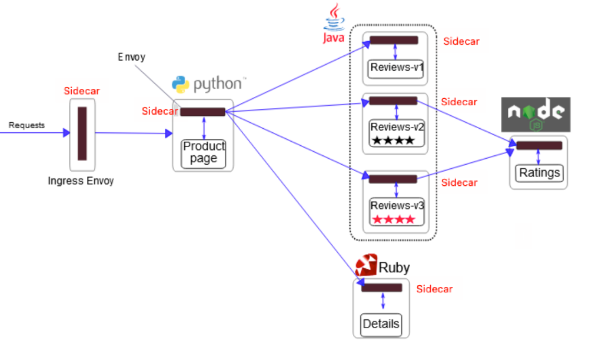
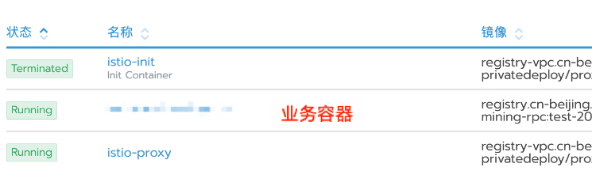
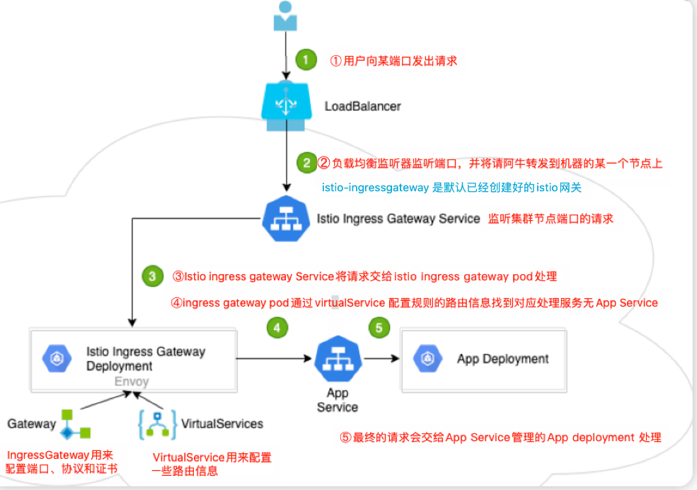

# istio部署微服务

## 项目介绍

- 该项目由四个微服务构成，这个应用模仿在线书店的一个分类，显示一本书的信息
- 页面上会显示一本书的描述，书籍的细节，以及关于这本书的评论
- Bookinfo应用分为四个单独的微服务
  - productpage 这个服务会调用detail和reviews两个微服务，用来生成页面
  - detail这个微服务中包含了书籍的信息
  - reviews这个微服务包含了书籍相关的评论，他还会调用ratings微服务
  - ratings这个微服务包含了由书籍组成的评级信息
- reviews这个微服务有三个版本
  - v1版本不会调用ratings服务
  - v2版本调用ratings服务，并使用1-5个黑色星形来进行评级
  - v3版本调用ratings服务，并使用1-5个红色星形来进行评级

## 注入envoy sidecar

1. 架构说明

   - 要在istio中运行这以应用，无需对自身做出任何改变
   - 只要简单的在istio环境中对服务进行配置和运行，具体一点就是把envoy sidecar 注入到每个服务中
   - 所有的微服务都和envoy sidecar集成在一起，被集成服务的所有流量都被envoy sidecar劫持
   - 这样就为外部控制准备了所需要的hook,然后就可以利用istio控制平面为应用提供服务路由、遥测数据收集以及策略实施功能

   

2. 打标签注入

   - 进入istio目录

   - istio默认自动注入sidecar，需要为default命名空间打上标签istio-injection=enable

   - 打完标签后，default命名空间的所有pod都会自动注入sidecar代理

   - ```
     kubectl label namespace default istio-injection=enabled 
     ```

     

   -  使用kubectl部署应用

   - 上面的命令会启动全部的四个服务，其中也包括了reviews服务的三个版本（v1, v2,v3）

   - ```sh
     cd istio-1.10.1 
     kubectl apply -f samples/bookinfo/platform/kube/bookinfo.yaml 
     
     ```

3. istio-init和istio-proxy

   - 这个时候再去看下新的pod信息，已经被自动注入了以下两个容器：istio-proxy、istio-init

   - istio-init

     - 作用是配置iptables规则，将出入站的流量交给istio-proxy代理
     - istio-init 容器会在应用容器启动之前运行，并且执行完成后就退出了，通常用来完成一些初始化任务

   - istio-proxy

     - 真正的sidecar, 基于envoy 实现

     - istio-proxy是如何获取应用容器的入站和出站流量的？答案就在istio-init这个容器的iptable中

     - iptable中会将出入流量重定向到istio-proxy容器对应的端口

     - ```sh
       -p 15001 表示出站流量被 iptable 重定向到 Envoy 的15001 端口
       -z 15006 表示入站流量被 iptable 重定向到 Envoy 的15006 端口
       -u 1337 用于排除用户ID 为1337 即 istio-proxy 自身的流量
       
       ```

     

# 部署服务


## bookinfo.yaml

> 官方地址：
>
> - https://istio.io/latest/docs/examples/bookinfo/
> - https://raw.githubusercontent.com/istio/istio/release-1.15/samples/bookinfo/platform/kube/bookinfo.yaml

1. detail书籍信息

```yaml
##################################################################################################
# Details service
##################################################################################################
apiVersion: v1
kind: Service   # Service本质就是一个LB负载均衡器
metadata:
  name: details
  labels:
    app: details
    service: details
spec:
  ports:
  - port: 9080
    name: http
  selector:
    app: details
---
apiVersion: v1
kind: ServiceAccount  # ServiceAccount给pod里面的进程使用，为pod提供必要的身份认证
metadata:
  name: bookinfo-details
  labels:
    account: details

---
apiVersion: apps/v1
kind: Deployment     # Deployment控制器管理Pod对象，滚动更新等
metadata:
  name: details-v1   # 控制器的名字是 “details-v1”
  labels:
    app: details
    version: v1
spec:
  replicas: 1       # 指定 “details-v1”这个控制器管理的pod是1个
  selector:
    matchLabels:   # 给pod指定标签
      app: details
      version: v1
  template:        # 上面控制器创建的pod使用的都是这个模板来定义的
    metadata:
      labels:
        app: details   # 指定创建的pod有那些标签
        version: v1
    spec:
      serviceAccountName: bookinfo-details
      containers:
      - name: details  # 指定容器的名字是 details
        image: docker.io/istio/examples-bookinfo-details-v1:1.17.0  # 使用镜像版本
        imagePullPolicy: IfNotPresent
        ports:
        - containerPort: 9080
        securityContext:
          runAsUser: 1000
---

```


2. ratings书籍评价

   ```yaml
   ##################################################################################################
   # Ratings service
   ##################################################################################################
   apiVersion: v1
   kind: Service
   metadata:
     name: ratings
     labels:
       app: ratings
       service: ratings
   spec:
     ports:
     - port: 9080
       name: http
     selector:
       app: ratings
   ---
   apiVersion: v1
   kind: ServiceAccount
   metadata:
     name: bookinfo-ratings
     labels:
       account: ratings
   ---
   apiVersion: apps/v1
   kind: Deployment
   metadata:
     name: ratings-v1
     labels:
       app: ratings
       version: v1
   spec:
     replicas: 1
     selector:
       matchLabels:
         app: ratings
         version: v1
     template:
       metadata:
         labels:
           app: ratings
           version: v1
       spec:
         serviceAccountName: bookinfo-ratings
         containers:
         - name: ratings
           image: docker.io/istio/examples-bookinfo-ratings-v1:1.17.0
           imagePullPolicy: IfNotPresent
           ports:
           - containerPort: 9080
           securityContext:
             runAsUser: 1000
   ---
   
   ```

   

3. reviews书籍评论v1,v2, v3

   ```yaml
   ##################################################################################################
   # Reviews service
   ##################################################################################################
   apiVersion: v1
   kind: Service
   metadata:
     name: reviews
     labels:
       app: reviews
       service: reviews
   spec:
     ports:
     - port: 9080
       name: http
     selector:
       app: reviews
   ---
   apiVersion: v1
   kind: ServiceAccount
   metadata:
     name: bookinfo-reviews
     labels:
       account: reviews
   ---
   apiVersion: apps/v1
   kind: Deployment
   metadata:
     name: reviews-v1
     labels:
       app: reviews
       version: v1
   spec:
     replicas: 1
     selector:
       matchLabels:
         app: reviews
         version: v1
     template:
       metadata:
         labels:
           app: reviews
           version: v1
       spec:
         serviceAccountName: bookinfo-reviews
         containers:
         - name: reviews
           image: docker.io/istio/examples-bookinfo-reviews-v1:1.17.0
           imagePullPolicy: IfNotPresent
           env:
           - name: LOG_DIR
             value: "/tmp/logs"
           ports:
           - containerPort: 9080
           volumeMounts:
           - name: tmp
             mountPath: /tmp
           - name: wlp-output
             mountPath: /opt/ibm/wlp/output
           securityContext:
             runAsUser: 1000
         volumes:
         - name: wlp-output
           emptyDir: {}
         - name: tmp
           emptyDir: {}
   ---
   apiVersion: apps/v1
   kind: Deployment
   metadata:
     name: reviews-v2
     labels:
       app: reviews
       version: v2
   spec:
     replicas: 1
     selector:
       matchLabels:
         app: reviews
         version: v2
     template:
       metadata:
         labels:
           app: reviews
           version: v2
       spec:
         serviceAccountName: bookinfo-reviews
         containers:
         - name: reviews
           image: docker.io/istio/examples-bookinfo-reviews-v2:1.17.0
           imagePullPolicy: IfNotPresent
           env:
           - name: LOG_DIR
             value: "/tmp/logs"
           ports:
           - containerPort: 9080
           volumeMounts:
           - name: tmp
             mountPath: /tmp
           - name: wlp-output
             mountPath: /opt/ibm/wlp/output
           securityContext:
             runAsUser: 1000
         volumes:
         - name: wlp-output
           emptyDir: {}
         - name: tmp
           emptyDir: {}
   ---
   apiVersion: apps/v1
   kind: Deployment
   metadata:
     name: reviews-v3
     labels:
       app: reviews
       version: v3
   spec:
     replicas: 1
     selector:
       matchLabels:
         app: reviews
         version: v3
     template:
       metadata:
         labels:
           app: reviews
           version: v3
       spec:
         serviceAccountName: bookinfo-reviews
         containers:
         - name: reviews
           image: docker.io/istio/examples-bookinfo-reviews-v3:1.17.0
           imagePullPolicy: IfNotPresent
           env:
           - name: LOG_DIR
             value: "/tmp/logs"
           ports:
           - containerPort: 9080
           volumeMounts:
           - name: tmp
             mountPath: /tmp
           - name: wlp-output
             mountPath: /opt/ibm/wlp/output
           securityContext:
             runAsUser: 1000
         volumes:
         - name: wlp-output
           emptyDir: {}
         - name: tmp
           emptyDir: {}
   ---
   
   ```

   

4. productpage前端页面

   ```yaml
   ##################################################################################################
   # Productpage services
   ##################################################################################################
   apiVersion: v1
   kind: Service
   metadata:
     name: productpage
     labels:
       app: productpage
       service: productpage
   spec:
     ports:
     - port: 9080
       name: http
     selector:
       app: productpage
   ---
   apiVersion: v1
   kind: ServiceAccount
   metadata:
     name: bookinfo-productpage
     labels:
       account: productpage
   ---
   apiVersion: apps/v1
   kind: Deployment
   metadata:
     name: productpage-v1
     labels:
       app: productpage
       version: v1
   spec:
     replicas: 1
     selector:
       matchLabels:
         app: productpage
         version: v1
     template:
       metadata:
         labels:
           app: productpage
           version: v1
       spec:
         serviceAccountName: bookinfo-productpage
         containers:
         - name: productpage
           image: docker.io/istio/examples-bookinfo-productpage-v1:1.17.0
           imagePullPolicy: IfNotPresent
           ports:
           - containerPort: 9080
           volumeMounts:
           - name: tmp
             mountPath: /tmp
           securityContext:
             runAsUser: 1000
         volumes:
         - name: tmp
           emptyDir: {}
   ---
   
   ```

   

## bookinfo-gateway.yaml

- https://raw.githubusercontent.com/istio/istio/release-1.15/samples/bookinfo/networking/bookinfo-gateway.yaml

- 网关接受到请求后会按照路由配置转发到VirtualService虚拟服务

- ```
  $ kubectl apply -f samples/bookinfo/networking/bookinfo-gateway.yaml
  ```

- ```
  apiVersion: networking.istio.io/v1alpha3
  kind: Gateway  # istio的网关资源
  metadata:
    name: bookinfo-gateway  # 网关名字(这个资源是 ingressgateway)
  spec:
    selector:
      istio: ingressgateway  # 使用istio默认控制器(将ingressgateway关联到istio-ingressgateway全局网关)
                             # 外网是通过 istio-ingressgateway 网关来代理流量给 ingressgateway 的
    servers:
    - port:
        number: 80  # 网关监听端口
        name: http
        protocol: HTTP
      hosts:
      - "*"
  ---
  apiVersion: networking.istio.io/v1alpha3
  kind: VirtualService  # VirtualService虚拟服务
  metadata:
    name: bookinfo
  spec:
    hosts:
    - "*"
    gateways:
    - bookinfo-gateway  # 将虚拟服务绑定到istio bookinfo-gateway这个网关
    http:
    - match:  # 定义匹配规则，访问这些url就会转发到 productpage服务
      - uri:
          exact: /productpage
      - uri:
          prefix: /static
      - uri:
          exact: /login
      - uri:
          exact: /logout
      - uri:
          prefix: /api/v1/products
      route:
      - destination:
          host: productpage  # productpage是服务名字 默认后缀是 .default.svc.cluster.local
          port:
            number: 9080
  
  ```

- 配置ingressgateway网关

- ```
  kubectl edit svc istio- ingressgateway-n istio-system
  
  ```

- 

- 此时使用http://本机地址/productionpage 访问页面

## istio核心资源

## gateway

- 在kubernetes环境中，ingress control用于管理进入集群的流量
- 在istio服务网格中，istio ingress gateway承担响应的角色
- 他使用新的配置模型（gateway 和virtualservice）完成流量管理功能
-  `网关配置应用于在网格边缘运行的独立 Envoy 代理`，`而不是与服务工作负载一起运行的 Sidecar Envoy 代理` 

- 所以我们配置的 gateway资源指的是 下图中的 ② istio-ingressgateway


### 访问流程

1. 用户向某端口发出请求
2. 负载均衡器监听端口，并将请求转发到集群的某个节点上
   1. istio ingress gateway service 会监听集群节点端口请求
3. istio ingress gate service将请求交给 istio ingres gateway pod请求
   - ingress gateway pod 通过gateway和virtualservice配置规则处理请求
   - 其中， gateway用来配置端口，协议和证书；virtualservice用来配置一些路由信息（找到请求对应处理服务app service）
4. istio ingress gateway pod 将请求转给app service
5. 最终的请求会交给app servie关联的app deployment处理



## gateway.yaml

-  网关是一个运行在网格边缘的负载均衡器，用于接收传入或传出的 HTTP/TCP 连接 

-  主要工作是接受外部请求，把请求转发到内部服务 

- 网格边缘的 Ingress 流量，会通过对应的 Istio IngressGateway Controller 进入到集群内部。

- 在上面这个 yaml 里我们配置了一个监听 80 端口的入口网关，它会将 80 端口的 http 流量导入到集群内对应的 Virtual Service 上。

- **istio gateway告诉k8s istio-ingressgateway可以打开哪些端口**

- ```yaml
  apiVersion: networking.istio.io/v1beta1
  kind: Gateway
  metadata:
    name: canary-gateway
  spec:
    selector:
      istio: ingressgateway
    servers:
    - port:
        number: 80
        name: http
        protocol: HTTP
      hosts:
      - "*"    # *表示通配符，通过任何域名都可以访问
  ```

## VirtualService

- VirtualService 是 Istio 流量治理的一个核心配置，可以说是 Istio 流量治理中最重要、最复杂的。
- VirtualService 在形式上表示一个虚拟服务，将满足条件的流量都转发到对应的服务后端
- 这个服务后端可以是一个服务，也可以是在 DestinationRule 中定义的服务的子集。


1. #### virtual.yaml

   - 这个虚拟服务会收到上一个 gateway 中所有 80 端口来的 http 流量

   - ```yaml
     apiVersion: networking.istio.io/v1beta1
     kind: VirtualService
     metadata:
       name: canary
     spec:
       hosts:
       - "*"  # *表示通配符，任何域名都可以，也可以配置具体域名 eg: www.example.com
              # 1）hosts：虚拟主机名称，它是客户端向服务发送请求时使用的一个或多个地址
              # 通过该字段提供的地址访问 virtual service，进而访问后端服务
              # 在集群内部(网格内)使用时通常与 kubernetes 的 Service 同名
              # 当需要在集群外部(网格外)访问时，该字段为 gateway 请求的地址，即与 gateway 的 hosts 字段相同
       gateways:
       - canary-gateway
       http:
       - route:
         - destination:
             host: canary.default.svc.cluster.local
             subset: v1
           weight: 90
         - destination:
             host: canary.default.svc.cluster.local
             subset: v2
           weight: 10
     
     ```

   - 

2. headers匹配

   ```yaml
   apiVersion: networking.istio.io/v1alpha3
   kind: VirtualService
   metadata:
     name: reviews
   spec:
     hosts:
     - reviews
     http:
     - match:
       - headers:
             end-user:  # 此路由接收来自 ”jason“ 用户的所有请求，把请求发送到 destination 指定的 v2 子集
               exact: jason
       route:
       - destination:
           host: reviews
           subset: v2
     - route:
       - destination:  # 不满足第一个路由规则的流量均流向一个默认的目标，第二条规则没有 match 条件，直接将流量导向 v3 子集
           host: reviews
           subset: v3
   
   ```

   

3. 多路由规则

   ```
   路由规则是将特定流量子集路由到指定目标地址的工具。
   可以在流量端口、header 字段、URI 等内容上设置匹配条件。
   例如，下面这个虚拟服务让用户发送请求到两个独立的服务：ratings 和 reviews，
   http://bookinfo.com/ratings 请求转发到 ratings 服务
   http://bookinfo.com/reviews 请求转发到 reviews 服务
   虚拟服务规则根据请求的 URI 把请求路由到特定的目标地址
   ```

   

   ```yaml
   kind: VirtualService
   metadata:
     name: bookinfo
   spec:
     hosts:
       - bookinfo.com
            # 1）hosts：虚拟主机名称，它是客户端向服务发送请求时使用的一个或多个地址
            # 通过该字段提供的地址访问 virtual service，进而访问后端服务
            # 在集群内部(网格内)使用时通常与 kubernetes 的 Service 同名
            # 当需要在集群外部(网格外)访问时，该字段为 gateway 请求的地址，即与 gateway 的 hosts 字段相同
     http:
     - match:
       - uri: 
           prefix: /reviews
       route:
       - destination:
           host: reviews  # 路由的 destination 字段指定了匹配条件的流量的实际地址
                          # 与 virtual service 的主机不同，该host 必须是存在于 istio 的服务注册表
                          # (如 kubernetes services，consul services 等)中的真实目的地或由 ServiceEntries 声明的 hosts
                          # 否则 Envoy 不知道应该将流量发送到哪里
     - match:
       - uri:
           prefix: /ratings
       route:
       - destination:
           host: ratings
           
   ```

4. ### DestinationRule.yaml

   - destination rule 是 istio 流量路由功能的重要组成部分。
   - 一个 virtual service 可以看作是如何将流量分发给特定的目的地，然后调用 destination rule 来配置分发到该目的地的流量。
   - destination rule 在 virtual service 的路由规则之后起作用，应用于真实的目的地。
     - (即在 virtual service 的 math->route-destination 之后起作用，此时流量已经分发到真实的 service 上)
   - 可以使用 destination rule 来指定命名的服务子集，例如根据版本对服务的实例进行分组
   - 然后通过 virtual service 的路由规则中的服务子集将控制流量分发到不同服务的实例中

   

   

   ```
   apiVersion: networking.istio.io/v1beta1 
   kind: DestinationRule 
   metadata: 
     name: canary 
   spec: 
     host: canary.default.svc.cluster.local 
     subsets: 
     - name: v1 
       labels: 
         app: v1 
     - name: v2 
       labels: 
         app: v2
   
   ```

   